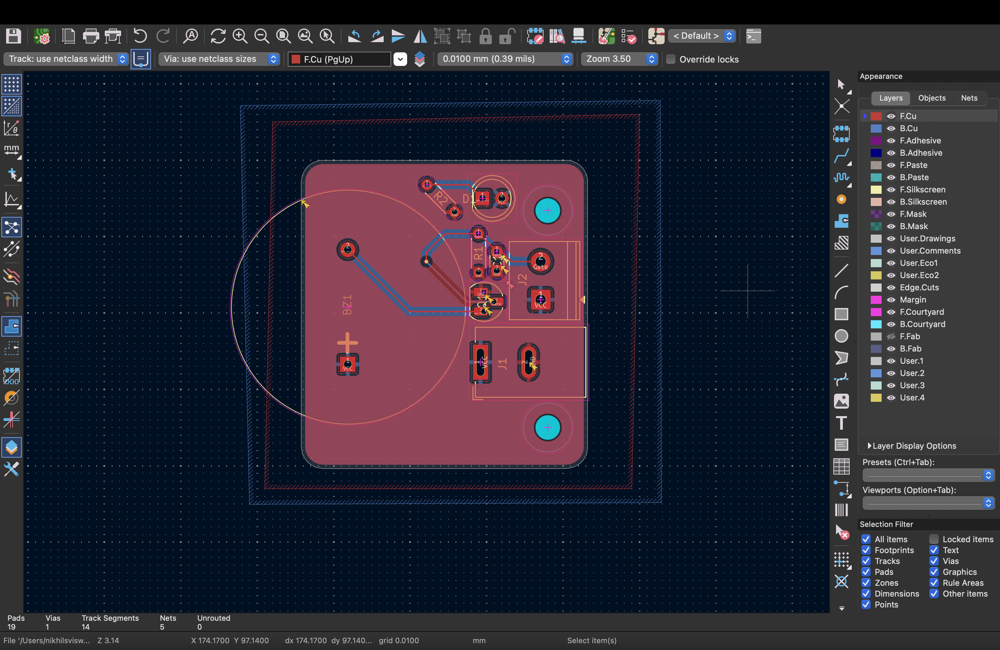
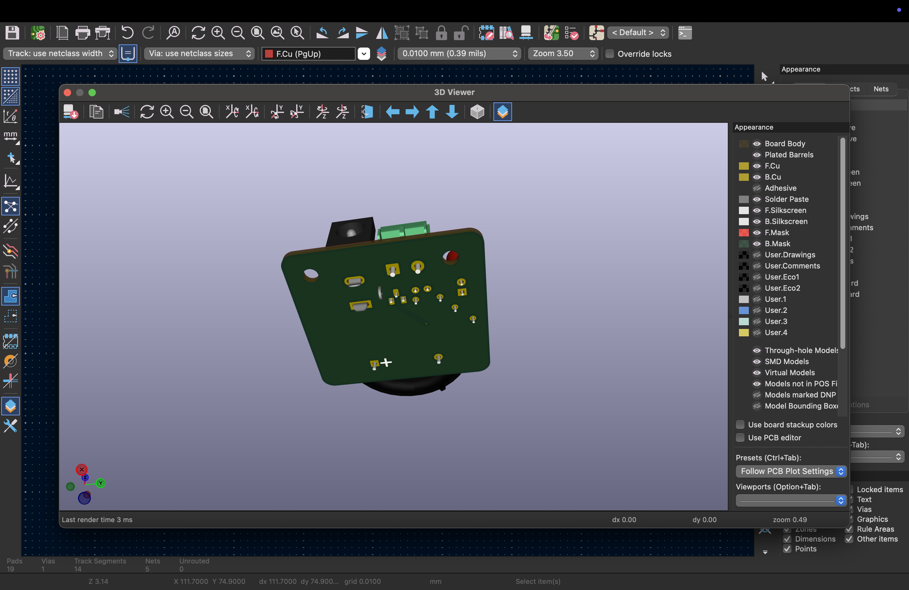
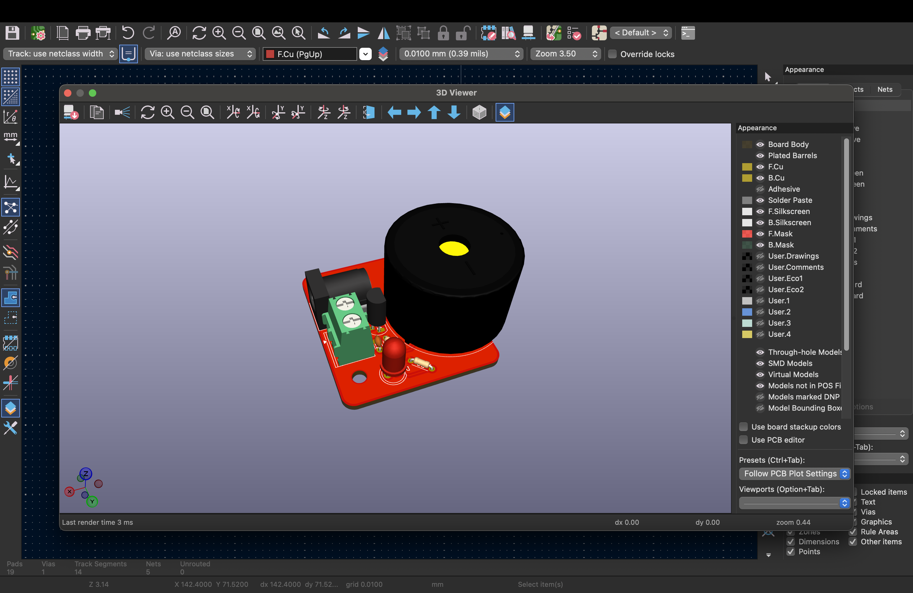
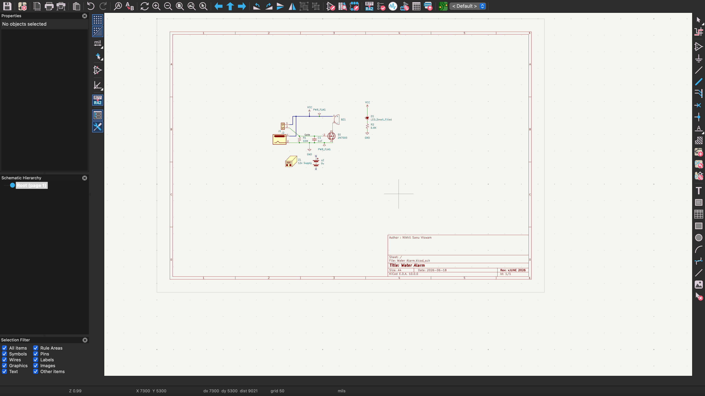

# 💧 Water Alarm PCB — KiCad Design

A simple, low-cost water detection alarm PCB designed in **KiCad 10.0** as a beginner PCB project.  
Triggered by water contact, it activates a buzzer and LED to alert the user.

> 📖 Based on the [DigiKey Water Alarm project](https://www.digikey.de/en/maker/projects/water-alarm-priceless-protection-crazy-simple/ee442d13e7164b99acb52793b56af391) — a great starter project for learning PCB design!

---

## 📸 PCB Preview

| PCB Layout (KiCad) | 3D View — Front | 3D View — Back |
|---|---|---|
|  |  |  |

| 3D Isometric View | Schematic |
|---|---|
|  |  |

---

## ⚙️ How It Works

When water bridges the two sensor probe contacts (J2), it provides a conduction path that biases the gate of the **2N7000 N-channel MOSFET (Q1)**. The MOSFET turns on, completing the circuit for both the **buzzer (BZ1)** and the **status LED (D1)** — alerting you to the presence of water.

The **10MΩ pull-down resistor (R1)** keeps the MOSFET gate held LOW when no water is detected, preventing false triggers. The **5.6kΩ resistor (R2)** limits current through the LED.

---

## 🧩 Bill of Materials (BOM)

| Ref | Component | Value / Part | Package |
|-----|-----------|--------------|---------|
| Q1  | N-Channel MOSFET | 2N7000 | TO-92 Inline |
| BZ1 | Piezo Buzzer | — | Through-hole |
| D1  | LED | LED_Small_Filled | LED_D5.0mm THT |
| R1  | Resistor | 10 MΩ | Axial DIN0204 |
| R2  | Resistor | 5.6 kΩ | Axial THT |
| C1  | Capacitor | 1 µF | THT |
| J1  | DC Barrel Jack | 12V Supply | BarrelJack |
| J2  | Screw Terminal | Water Probe | 2-pin Screw Terminal |

---

## 📁 Project File Structure

```
Water_Alarm/
├── Water_Alarm.kicad_pro       # KiCad project file
├── Water_Alarm.kicad_sch       # Schematic
├── Water_Alarm.kicad_pcb       # PCB layout
├── Water_Alarm.kicad_prl       # Local project settings
└── screenshots/
    ├── pcb_layout.png
    ├── 3d_front.png
    ├── 3d_back.png
    ├── 3d_iso.png
    └── schematic.png
```

---

## 🛠️ Tools Used

- [KiCad 10.0](https://www.kicad.org/) — Schematic capture & PCB layout
- KiCad 3D Viewer — Board visualisation
- Reference: [DigiKey Water Alarm Tutorial](https://www.digikey.de/en/maker/projects/water-alarm-priceless-protection-crazy-simple/ee442d13e7164b99acb52793b56af391)

---

## 🚀 PCB Specs

| Parameter | Value |
|-----------|-------|
| Layers | 2 (F.Cu + B.Cu) |
| Board size | ~45 × 40 mm |
| Track segments | 14 |
| Nets | 5 |
| Vias | 1 |
| Total pads | 19 |

---

## 👤 Author

**Nikhil Sanu Viswam**  
Designed: June 2026  
KiCad Version: 10.0.0

---

## 📄 License

This project is open source and free to use for learning and personal projects.  
Please credit the original DigiKey tutorial if you build upon this work.
